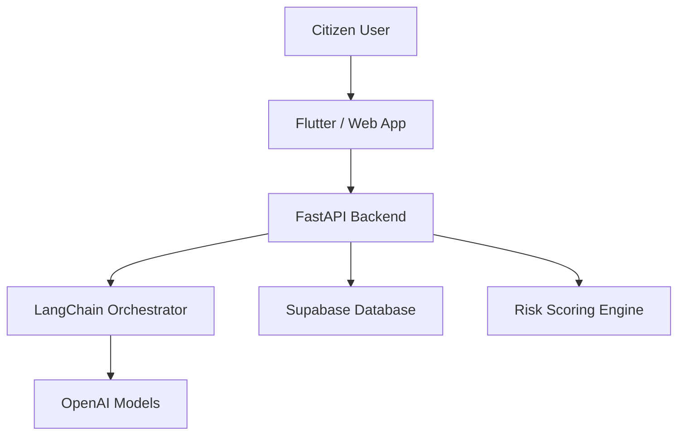

# JamboSec — Swahili AI Cybersecurity Awareness Assistant
> Empowering Kenyan communities with bilingual cyber hygiene guidance.
> Stay safe online with real-time, culturally aware coaching.


---

       

---

## Table of Contents
- [Overview](#overview)
- [Features](#features)
- [Tech Stack](#tech-stack)
- [Installation & Setup](#installation--setup)
- [Environment Variables](#environment-variables)
- [Usage Guide](#usage-guide)
- [Screenshots / Visuals](#screenshots--visuals)
- [Folder Structure](#folder-structure)
- [API Reference (Endpoints Overview)](#api-reference-endpoints-overview)
- [Future Improvements](#future-improvements)
- [Contributing](#contributing)
- [License](#license)

## Overview
JamboSec is an AI-powered cybersecurity awareness assistant crafted for Kenyan citizens. Through a chat-first interface, it delivers practical guidance in both Swahili and English, helping users recognize phishing attempts, protect personal data, and stay resilient against online scams.

> "Cyber hygiene made simple, conversational, and culturally relevant."

## Features
- 💬 **Bilingual Chatbot** — Seamless conversations in Swahili and English with localized guidance.
- 🧠 **Phishing Detection Coaching** — Interactive prompts that teach users how to spot suspicious messages.
- 🔐 **Privacy by Design** — Client-side anonymization and secure storage with Supabase policies.
- 📚 **Micro-Lessons Library** — Bite-sized lessons on trending cyber threats tailored to Kenyan contexts.
- 🔄 **Adaptive Tone & Persona** — Adjusts tone for youth, parents, and SMEs for higher engagement.
- 📊 **Insights Dashboard** — Aggregated analytics (safe, anonymized) for impact reporting.

## Tech Stack
- Frontend: `React (Vite)`, `TypeScript`, `TailwindCSS`
- Mobile Preview: 
- Backend Services:  
- Data & Auth: 
- AI Orchestration:  

## Installation & Setup

### 1. Clone the repository
```bash
git clone https://github.com/<your-org>/jamboSec.Ai.git
cd jamboSec.Ai
```

### 2. Frontend (Web — React/Vite)
```bash
cd niru_frontend
npm install
npm run dev
```
The development server runs at `http://localhost:5173` by default.

### 3. Frontend (Mobile Preview — Flutter)
```bash
cd mobile_app
flutter pub get
flutter run
```
> *Optional:* The Flutter app mirrors the web experience for Android/iOS pilots.

### 4. Backend (FastAPI Service)
```bash
cd niru_backend
python -m venv venv
source venv/bin/activate
pip install -r requirements.txt
uvicorn app.main:app --reload --host 0.0.0.0 --port 8000
```
API will be available at `http://localhost:8000/api`.

### 5. Database & Auth (Supabase)
```bash
supabase login
supabase link --project-ref <project-ref>
supabase db push
```
Configure Supabase policies for row-level security and storage buckets.

---

## Environment Variables
Create a `.env` file in `niru_frontend` (and analogous files for other services) with the following keys:

```dotenv
VITE_API_BASE_URL=http://localhost:8000/api
VITE_OPENAI_API_KEY=sk-xxxxxxxxxxxxxxxxxxxx
VITE_SUPABASE_URL=https://<project>.supabase.co
VITE_SUPABASE_ANON_KEY=eyJhbGciOiJIUzI1NiIsInR5cCI...
VITE_LANGCHAIN_CALLBACK_URL=https://api.langchainplus.io
```

For the FastAPI backend (`niru_backend/.env`):
```dotenv
OPENAI_API_KEY=sk-xxxxxxxxxxxxxxxxxxxx
SUPABASE_URL=https://<project>.supabase.co
SUPABASE_SERVICE_ROLE_KEY=eyJhbGciOiJIUzI1NiIsInR5cCI...
LANGCHAIN_API_KEY=lc_xxxxxxxxxxxxxxxxxxxx
JWT_SECRET=super-secret-key
```

## Usage Guide
1. Launch the web app and authenticate using the demo account or register a new profile.
2. Initiate a chat with prompts such as:
   - *"Nimepokea SMS kuhusu kushinda bahati nasibu, ni salama?"*
   - *"How do I secure my M-Pesa PIN when using public Wi-Fi?"*
3. Review AI-generated advice, phishing risk scores, and recommended next steps.
4. Browse the Lessons tab for curated micro-courses and quizzes.
5. Developers can run automated checks:
```bash
# Frontend unit tests
npm run test

# Linting
npm run lint

# Storybook docs preview (if enabled)
npm run storybook
```

> Need demo credentials? Reach out via the `#jambosec-dev` Slack channel.

## Screenshots / Visuals




## Folder Structure
```bash
niru_frontend/
├── public/
├── src/
│   ├── app/
│   ├── components/
│   ├── features/
│   ├── config/
│   ├── hooks/
│   └── routes/
├── package.json
└── README.md
```
> Companion directories: `niru_backend/` (API + AI services), `mobile_app/` (Flutter client), `supabase/` (database migrations & policies).

## API Reference (Endpoints Overview)
_All endpoints are prefixed with `/api` on the FastAPI service._

### POST `/api/chat`
Initiates a bilingual chat session or continues an existing thread.
```json
{
  "conversation_id": "22bf7bcd-0ef5-49a7-8d0f-305abf2d3ef0",
  "message": "Nisaidie kutambua kama hii email ni scam"
}
```
**Sample response**
```json
{
  "conversation_id": "22bf7bcd-0ef5-49a7-8d0f-305abf2d3ef0",
  "reply": "Inaonekana kama hii email ina viashiria vya ulaghai...",
  "risk_score": 0.82,
  "language": "sw",
  "suggested_actions": [
    "Usifungue viambatanisho vyovyote",
    "Ripoti kwa huduma ya mteja ya benki yako"
  ]
}
```

### POST `/api/analyze`
Uploads a suspicious message or URL for AI-assisted risk analysis.
```json
{
  "artifact_type": "sms",
  "content": "Umemaliza kushinda 50000/= bonyeza hapa...",
  "channel": "mobile",
  "metadata": {
    "carrier": "Safaricom"
  }
}
```
**Sample response**
```json
{
  "verdict": "high-risk",
  "explanation": "Inatumia lugha ya kutengeneza dharura na kiungo kifupi.",
  "recommended_steps": ["Block sender", "Report via eCitizen"],
  "confidence": 0.91
}
```

### GET `/api/lessons`
Fetches localized micro-lessons for awareness campaigns.
```json
[
  {
    "id": "phishing-101",
    "title": "Kutambua Phishing Emails",
    "language": "sw",
    "estimated_time": 5,
    "tags": ["email", "smes"],
    "cta": "Anza somo"
  }
]
```

> Full OpenAPI docs available at `http://localhost:8000/api/docs` once the backend is running.

## Future Improvements
- Voice interaction for accessibility and community radio integrations.
- Offline lesson access via Progressive Web App caching.
- WhatsApp chatbot integration leveraging Meta Cloud APIs.

## Contributing
1. Fork the repository.
2. Create a feature branch: `git checkout -b feature/amazing-improvement`.
3. Commit changes: `git commit -m "feat: add amazing improvement"`.
4. Push to origin: `git push origin feature/amazing-improvement`.
5. Open a Pull Request describing your changes and testing notes.

> We follow conventional commits and require at least one peer review before merging.

## License
This project is licensed under the **MIT License** — see the root `LICENSE` file for details.

> *Built with ❤️ by Team JamboSec for the AI Hackathon 2025.*

